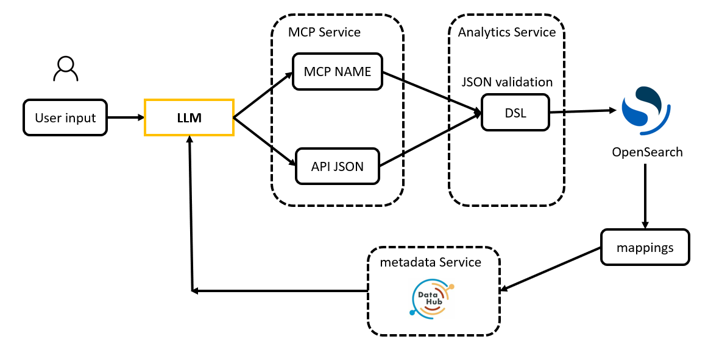
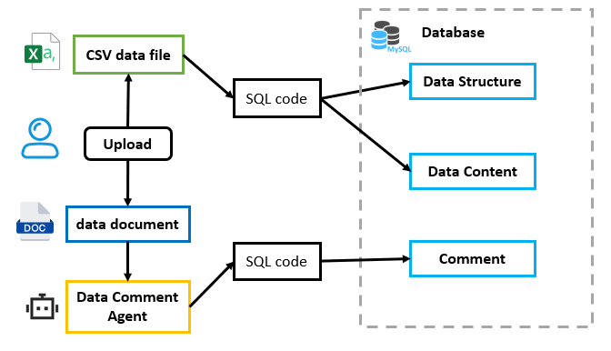
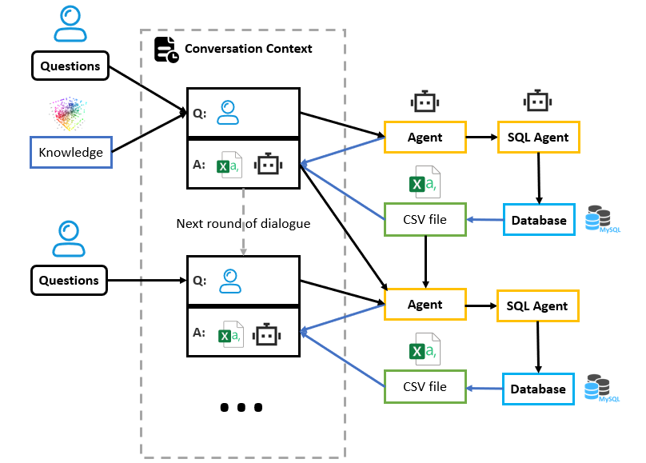

# data copilot v6

✨ **基于代码生成和函数调用(function call)的大语言模型(LLM)数据分析智能体**
支持任意数据集和描述文档一键智能导入与智能图表绘制，通过多智能体协作和上下文长数据记忆，实现精准的自然语言查询与可视化分析。

🚩[English Readme](./README.en.md)

### 相关项目
- [基于大语言模型 (LLM) 的<u>**可解释型**</u>自然语言数据库查询系统 https://github.com/bytesc/data-copilot-steps](https://github.com/bytesc/data-copilot-steps)
- [基于大语言模型 (LLM)和并发预测模型的自然语言数据库查询系统 (https://github.com/bytesc/data-copilot-v2](https://github.com/bytesc/data-copilot-v2)

[个人网站：www.bytesc.top](http://www.bytesc.top)

🔔 如有项目相关问题，欢迎在本项目提出`issue`，我一般会在 24 小时内回复。

## 功能简介

- 1, 基于代码生成的大语言模型智能体(AI Agent)，实现数据查询智能绘制多种统计图表。
- 2, 实现智能体对用户的反问，解决用户提问模糊、不完整的情况。
- 3, 智能体支持灵活的自定义函数调用(function call)和思维链(COT)
- 4, 实现多智能体的合作调用
- 5, 能够处理大语言模型表现不稳定等异常情况
- 6, 上下文支持非文本长数据记忆，在多轮对话当中实现数据的存取
- 7, 支持任意数据表格一键导入数据库，支持任意文档生成数据注释标注


## 技术架构

### 核心组件与技术架构  

#### **1. 可配置的LLM主干模型**  
- 支持主流大模型（如GPT-4o、Claude等），灵活适配不同场景需求。  

#### **2. 动态工具调用的函数图谱（Function Graph）**  
- 智能选择最佳工具链，根据任务类型动态组合数据查询、分析与可视化功能。  

#### **3. 多智能体协作层**  
- 通过角色化Agent分工（如数据查询Agent、校验Agent、报告生成Agent）实现复杂任务流水线处理。  

### 工作流程



整体链路：用户提问 → LLM 通过 MCP 工具调用 Analytics Service → Service 基于 DataHub 元数据做权限校验+字段映射+DSL 生成 → OpenSearch 聚合 → 标准化 JSON 回传 LLM → 输出带业务解读的结论

#### 关键点
- LLM 全程不碰真实 SQL/DSL，只拼装 JSON Schema，杜绝胡写
- 图用固定绘图引擎（G2、Plotly、ECharts），JSON 驱动，稳定性最高
- 能力天花板被 Schema 限定，新增图表需发版

### 任意数据导入

任意 csv 文件，加上描述数据的文档即可被解析查询



1. 上传 csv 文件自动导入数据库
2. 上传数据描述文档调用数据标注 Agent 生成数据注释

### 上下文数据传递

数据的上下文传递和中期记忆



1. Agent 生成代码调用 sql agent 查询数据，查询结果自动保存为 csv 文件，文件链接存入上下文
2. 下一轮对话中 Agent 从上下文中获取 csv 数据文件链接，生成代码可以通过链接重新读取数据

## 如何使用

### 安装依赖

python 版本 3.10

```bash
pip install -r requirement.txt
```

### 配置文件

`./config/config.yaml`

### 大语言模型配置

新建文件：`agent\utils\llm_access\api_key_openai.txt` 在其中填写`api-key`

`api-key`获取链接：
- 阿里云:[https://bailian.console.aliyun.com/](https://bailian.console.aliyun.com/)
- deepseek:[https://api-docs.deepseek.com/](https://api-docs.deepseek.com/)
- glm:[https://open.bigmodel.cn/](https://open.bigmodel.cn/)

### 运行

#### 服务端

```bash
# 服务端
python ./main.py
```

启动后可以通过api访问服务

#### 前端

项目自带一个简单的pywebio图形界面

```bash
# 启动前端服务
python ./front.py
```

# 开源许可证

此翻译版本仅供参考，以 LICENSE 文件中的英文版本为准

MIT 开源许可证：

版权所有 (c) 2025 bytesc

特此授权，免费向任何获得本软件及相关文档文件（以下简称“软件”）副本的人提供使用、复制、修改、合并、出版、发行、再许可和/或销售软件的权利，但须遵守以下条件：

上述版权声明和本许可声明应包含在所有副本或实质性部分中。

本软件按“原样”提供，不作任何明示或暗示的保证，包括但不限于适销性、特定用途适用性和非侵权性。在任何情况下，作者或版权持有人均不对因使用本软件而产生的任何索赔、损害或其他责任负责，无论是在合同、侵权或其他方面。
